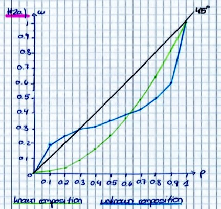
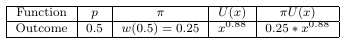

Assignment from Seminar Economics and Psychology of Risk and Time
========

When choosing between uncertain alternatives, Mary maximizes cumulative prospect theory with a weighting (“source”) function for a ball drawn from an urn with a known composition of balls $K$ equal to the weighting function for the performance of the Dow Jones index, both given by: 

$$w_K(p) = w_{DOW}(p) = p^2$$

The weighting function for balls drawn from an urn with an unknown composition of coloured balls $U$, as well as the weighting function for the performance of the AEX index are given by: 

$$w_U(p) = w_{AEX}(p) = p^{0.5}/(p^{0.5}+(1-p)^{0.5})^2)$$ 

Mary’s utility function is $u(x) = x^{0.88}$.

*a) Show that Mary can be ambiguity seeking for unlikely events and ambiguity averse for events of moderate likelihood when comparing lotteries with prizes depending on balls drawn from either the risky or the unknown urn.*

The points from the table above create the following graph:

As we can see in unlikely events (when $p<0.6$), Mary chooses the unknown composition, meaning that she is ambiguity seeking. For events with moderate or high probability (when $p>0.6$) Mary is ambiguity averse by preferring the known composition.
 

*b) Show that Mary can exhibit the home bias, assuming that she believes that the Dow Jones index and the AEX index will go up (and down) with probability 0.5.*

#####Dow Jones Index increases

	

######CPT(Dow Jones) = $0.25*x^{0.88}$

#####AEX Index increases

######CPT(AEX) = $0.3536*x^{0.88}$

In the event that Mary gets and equal, positive payoff if any of the indexes increases, she will always prefer the AEX index. This demonstrates the home bias for Mary.

